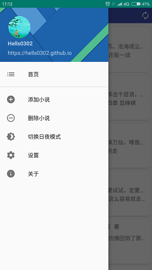
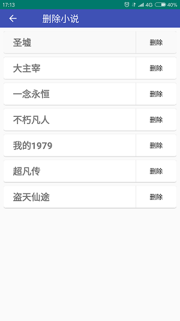
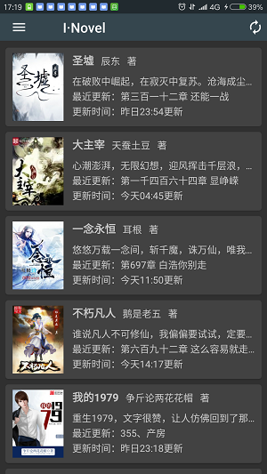
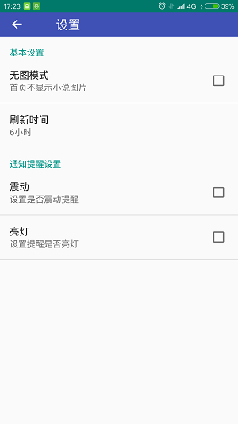
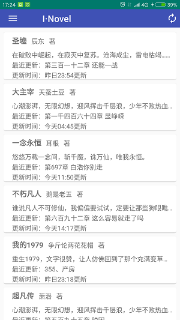
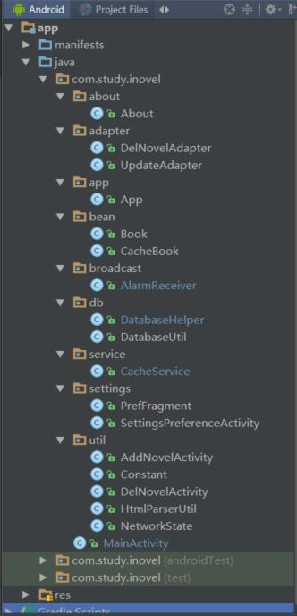

> 你是否喜欢看网络小说？
> 是否一遍遍的去刷新网页查看小说是否更新？
> 你是否迫切的想要一款app西东获取小数的更新情况，并发出提醒？

三天假期就快结束了，首先祝大家玩得开心。


# 声明
APP完全开源，所涉及的知识只是用来学习研究，不涉及商业，如拿开源代码用于商业经济活动，作者保留法律追究。

# 前言
自己有看小说的习惯，但是有时小说是否更新需要一遍遍的去刷新网页，耗时费神。最近一段时间忙于找实习面试看Android的一些知识。萌生了做一个提醒小说更新的app，顺便把最近看到学到的知识用上，既能方便自己又能巩固所学。
>项目地址：

效果图如下所示：

      
         


# 功能需求
因为自己一直看小说，获取更新的问题之前也想过。
* 正确获取小说更新情况
* 能够同时显示多个小说的更新情况
* 可以保存小说列表以后自动获取
* 后台根据设置的时间间隔自动刷新并发出通知
* 夜间模式
* 通知栏、震动、呼吸灯提醒

以上几个需求主要涉及了UI，网络，数据存储，后台服务，传感器使用等

# 可行性分析
首要的问题是怎么获取小数更新数据。这里使用了开源框架Jsoup。[Jsoup官网](https://jsoup.org/)摘抄官网简介介绍一下
> jsoup is a Java library for working with real-world HTML. It provides a very convenient API for extracting and manipulating data, using the best of DOM, CSS, and jquery-like methods.
> jsoup implements the WHATWG HTML5 specification, and parses HTML to the same DOM as modern browsers do.
* scrape and parse HTML from a URL, file, or string
* find and extract data, using DOM traversal or CSS selectors
* manipulate the HTML elements, attributes, and text
* clean user-submitted content against a safe white-list, to prevent XSS attacks
* output tidy HTML
jsoup is designed to deal with all varieties of HTML found in the wild; from pristine and validating, to invalid tag-soup; jsoup will create a sensible parse tree.

通过Jsoup获取整个网页的数据，完后分析得到自己想要的数据。现阶段只做了一个小说网站的解析工作
#UI
实验室没有做UI涉及的，参考做前端的大神给的建议，自己完成UI。期间也使用PS修图获取颜色代码等。推荐大家一个网站，上面的图标做的非常好。
> Material icons 
> https://material.io/icons/

#整体分析

整个项目结构是按照功能进行分包的，这样以后修改的时候方便查找。工程监理号后，需要导入一下第三方开源库，如下图所示
```
dependencies {
    compile fileTree(include: ['*.jar'], dir: 'libs')
    testCompile 'junit:junit:4.12'
    compile 'com.android.support:appcompat-v7:25.1.1'
    compile 'com.android.support:preference-v14:25.1.1'
    compile 'com.android.support:design:25.1.1'
    compile 'com.android.support:cardview-v7:25.1.1'
    compile files('libs/jsoup-1.10.2.jar')
    compile files('libs/picasso-2.5.2.jar')
}
```
之前选择网络框架的时候，打算先使用Android-async-http，volley，OkHttp中的一个先把网页获取下来，然后再利用Jsoup解析，在上班之余，做的这个app，投了个懒直接使用了Jsoup获取网页。
* 首先先把网页请求，数据获取的工具类写完。常量类Constant，数据获取类HtmlParserUtil，和网络状态检测类NetworkState类
* bean下的实体类Book和CacheBook，分别保存获取到的小说的一些信息，如小说名，作者，简介，图片Url，更新时间等
* Application的实现，用来获取全局context以及后面的夜间模式
* 小说更新情况显示，小说添加，删除用到的ListView以及相应的adapter的实现
* 后台服务，以及后台服务中的Notification，以及才重新启动service用的BroadcastReceiver
* 刷新间隔使用了Android的Alarm机制
* 设置界面则是使用了Activity+PreferenceFragment的模式
这里需要重点说明一下的是，数据库创建时使用了单例模式,关于单例模式的使用以及原理以后再详细阐述，这里不再过多描述。
```
  private DatabaseUtil(Context context)
    {
        DatabaseHelper dbHelper=new DatabaseHelper(context,DB_NAME,null,VERSION);
        db=dbHelper.getWritableDatabase();
    }
    public synchronized static DatabaseUtil getInstance(Context context)
    {
        if(databaseUtil==null)
        {
            databaseUtil=new DatabaseUtil(context);
        }
        return databaseUtil;
    }
```


#界面编写
主页显示小说更新详情主要分为有图模式和无图模式
主要说一下几个比较特殊的控件，其他具体请到GitHub下载代码。
MainActivity中主要使用了DrawerLayout，SwipeRefreshLayout，Toolbar，NavigationView等实现导航栏，下拉刷新，侧滑导航等功能
对应的布局如下：
```
<?xml version="1.0" encoding="utf-8"?>
<android.support.v4.widget.DrawerLayout xmlns:android="http://schemas.android.com/apk/res/android"
    xmlns:tools="http://schemas.android.com/tools"
    xmlns:app="http://schemas.android.com/apk/res-auto"
    android:id="@+id/drawer_layout"
    android:layout_width="match_parent"
    android:layout_height="match_parent"
    android:fitsSystemWindows="true"
    tools:openDrawer="start">
    <RelativeLayout xmlns:android="http://schemas.android.com/apk/res/android"
        xmlns:app="http://schemas.android.com/apk/res-auto"
        android:layout_width="match_parent"
        android:layout_height="match_parent"
        android:id="@+id/main"
        >
        <ProgressBar
            android:layout_marginTop="100dp"
            android:layout_centerHorizontal="true"
            android:id="@+id/pb"
            android:layout_width="wrap_content"
            android:layout_height="wrap_content"
            android:visibility="gone"
            />
        <LinearLayout
            android:orientation="vertical"
            android:layout_width="match_parent"
            android:layout_height="match_parent"
            >
            <RelativeLayout
                android:id="@+id/titleBar"
                android:layout_width="match_parent"
                android:layout_height="40dp"
                >
                <android.support.v7.widget.Toolbar
                    android:gravity="center_vertical"
                    android:id="@+id/toolbar"
                    android:layout_width="match_parent"
                    android:layout_height="wrap_content"
                    android:background="?attr/colorPrimary"
                    android:theme="@style/AppTheme.AppBarOverlay"
                    app:title="    I·Novel"
                    android:minHeight="40dp">
                    <ImageView
                        android:onClick="update"
                        android:paddingRight="5dp"
                        android:layout_gravity="right"
                        android:layout_width="wrap_content"
                        android:layout_height="wrap_content"
                        android:src="@drawable/ic_autorenew_white_24dp"/>
                </android.support.v7.widget.Toolbar>
            </RelativeLayout>

            <android.support.v4.widget.SwipeRefreshLayout
                android:layout_marginTop="10dp"
                android:layout_marginLeft="8dp"
                android:layout_marginRight="8dp"
                android:layout_width="match_parent"
                android:layout_height="wrap_content"
                app:layout_behavior="@string/appbar_scrolling_view_behavior"
                android:id="@+id/refreshLayout">
                <ListView
                    android:id="@+id/listView"
                    android:dividerHeight="8dp"
                    android:divider="@null"
                    android:layout_width="match_parent"
                    android:layout_height="wrap_content"
                    />
            </android.support.v4.widget.SwipeRefreshLayout>
        </LinearLayout>

    </RelativeLayout>
    <android.support.design.widget.NavigationView
        android:id="@+id/nav_view"
        android:layout_width="wrap_content"
        android:layout_height="match_parent"
        android:layout_gravity="start"
        app:headerLayout="@layout/nav_header"
        app:menu="@menu/drawer"
        android:fitsSystemWindows="true"
        />

</android.support.v4.widget.DrawerLayout>

```
ListView中显示小说更新的布局，这里用了CardView更美观一些
```
<?xml version="1.0" encoding="utf-8"?>
<android.support.v7.widget.CardView
    xmlns:android="http://schemas.android.com/apk/res/android"
    xmlns:app="http://schemas.android.com/apk/res-auto"
    android:layout_height="96dp"
    android:layout_width="match_parent"
    android:focusable="true"
    android:clickable="true"
    android:foreground="?android:attr/selectableItemBackground"
    app:cardCornerRadius="4dp"
    app:cardElevation="1dp"
    app:cardPreventCornerOverlap="true"
    android:layout_marginTop="8dp"
    android:layout_marginLeft="8dp"
    android:layout_marginRight="8dp">
    <LinearLayout
        android:paddingLeft="8dp"
        android:paddingRight="8dp"
        android:orientation="horizontal"
        android:layout_width="match_parent"
        android:layout_height="wrap_content">
        <ImageView
            android:layout_marginTop="8dp"
            android:layout_marginBottom="8dp"
            android:id="@+id/book_img"
            android:layout_width="80dp"
            android:layout_height="100dp"
            android:src="@drawable/bookimg"/>
        <LinearLayout

            android:orientation="vertical"
            android:layout_width="wrap_content"
            android:layout_height="match_parent">
            <LinearLayout
                android:layout_marginTop="8dp"
                android:layout_width="wrap_content"
                android:layout_height="wrap_content">
                <TextView
                    android:paddingLeft="10dp"
                    android:id="@+id/book_name"
                    android:layout_width="wrap_content"
                    android:layout_height="wrap_content"
                    android:textSize="16sp"
                    android:textStyle="bold"
                    android:text="圣墟"/>
                <TextView
                android:paddingLeft="10dp"
                android:id="@+id/author"
                android:layout_width="wrap_content"
                android:layout_height="wrap_content"
                android:text="辰东"/>
                <TextView
                    android:paddingLeft="10dp"
                    android:layout_width="wrap_content"
                    android:layout_height="wrap_content"
                    android:text="著"/>
            </LinearLayout>
            <TextView
                android:layout_marginTop="10dp"
                android:layout_marginLeft="10dp"
                android:id="@+id/info"
                android:layout_width="wrap_content"
                android:layout_height="wrap_content"
                android:singleLine="true"
                android:text="在破败中崛起，在寂灭中复苏。沧海成尘，雷电枯竭……"/>
            <LinearLayout
                android:paddingLeft="10dp"
                android:layout_marginTop="3dp"
                android:layout_width="wrap_content"
                android:layout_height="wrap_content">
                <TextView
                    android:layout_gravity="bottom"
                    android:layout_width="wrap_content"
                    android:layout_height="wrap_content"
                    android:text="最近更新："/>
                <TextView
                    android:layout_gravity="bottom"
                    android:id="@+id/update_title"
                    android:layout_width="wrap_content"
                    android:layout_height="wrap_content"
                    android:singleLine="true"
                    android:text="第三百零六章 难解"/>
            </LinearLayout>

            <LinearLayout
                android:paddingLeft="10dp"
                android:layout_marginTop="3dp"
                android:layout_width="wrap_content"
                android:layout_height="wrap_content">
                <TextView
                    android:layout_gravity="bottom"
                    android:layout_width="wrap_content"
                    android:layout_height="wrap_content"
                    android:text="更新时间："/>
                <TextView
                    android:layout_gravity="bottom"
                    android:id="@+id/update_time"
                    android:layout_width="wrap_content"
                    android:layout_height="wrap_content"
                    android:singleLine="true"
                    android:text="今天18:16更新"/>
            </LinearLayout>
        </LinearLayout>
    </LinearLayout>

</android.support.v7.widget.CardView>
```
设置界面使用了PreferenceFragment
对应的布局和Preference的xml如下
用FrameLayout来放置碎片布局
```
<LinearLayout xmlns:android="http://schemas.android.com/apk/res/android"
    xmlns:app="http://schemas.android.com/apk/res-auto"
    android:orientation="vertical"
    android:layout_width="match_parent"
    android:layout_height="match_parent"
    >
    <android.support.v7.widget.Toolbar
        android:gravity="center_vertical"
        android:id="@+id/setting_toolbar"
        android:layout_width="match_parent"
        android:layout_height="40dp"
        android:background="?attr/colorPrimary"
        android:theme="@style/AppTheme.AppBarOverlay"
        app:title="    设置">
    </android.support.v7.widget.Toolbar>
    <FrameLayout
        android:id="@+id/frameLayout"
        android:layout_width="match_parent"
        android:layout_height="0dp"
        android:layout_weight="1">
    </FrameLayout>
</LinearLayout>

```
设置的想用参数用PreferenceScreen设置，提供了SharedPreferences存储，无需手动设置
```
<?xml version="1.0" encoding="utf-8"?>
<PreferenceScreen xmlns:android="http://schemas.android.com/apk/res/android" >

    <PreferenceCategory
        android:title="基本设置">

        <CheckBoxPreference
            android:title="无图模式"
            android:key="no_picture_mode"
            android:defaultValue="false"
            android:summary="首页不显示小说图片" />

        <ListPreference
            android:title="刷新时间"
            android:key="time_of_refresh"
            android:entries="@array/time_to_refresh_pots"
            android:dialogTitle="请选择刷新时间"
            android:entryValues="@array/time_to_refresh"
            android:defaultValue="6"/>

    </PreferenceCategory>

    <PreferenceCategory
        android:title="通知提醒设置">

        <CheckBoxPreference
            android:title="震动"
            android:key="vibrator_mode"
            android:defaultValue="false"
            android:summary="设置是否震动提醒" />
        <CheckBoxPreference
            android:title="呼吸灯"
            android:key="light_mode"
            android:defaultValue="false"
            android:summary="设置呼吸灯闪烁提醒" />

    </PreferenceCategory>

</PreferenceScreen>
```
其他布局大体相似，具体请到GitHub下载源码

#刷新数据&&本地化数据
在小说添加界面所添加的小说绘存到相应的数据库表里实现数据本地化
为了节省流量以及刷新的时间，把获取小说链接地址的网络请求和获取小说更新详情的网络请求分别开来。获取小说更新详情的网络请求很频繁，而获取小说链接地址在添加小说或者删除小说时才需要获取。
```
    /**
     * 根据添加的小说获取小说详情链接地址
     */
    public void updateNovelInfoLink()
    {
        //如果添加的小说数量为0，则表示已删除所有小说，清空数据库缓存
        if(databaseUtil.getNovelLinkCount()==0)
        {
            databaseUtil.delNovelInfoLinkElement();
            refresh();
        }
        //当添加的小说总数和获取到的小说链接总数不同，说明再次添加小说或者删除小说，刷新
        if(databaseUtil.getNovelInfoLinkCount()!=databaseUtil.getNovelLinkCount())
        {
            databaseUtil.delNovelInfoLinkElement();
            if(NetworkState.networkConnected(MainActivity.this)&&(NetworkState.wifiConnected(MainActivity.this)||NetworkState.mobileDataConnected(MainActivity.this)))
            {
                new Thread(new Runnable() {
                    @Override
                    public void run() {
                        Map<String,String> map;
                        Iterator iterator;
                        List<Map<String,String>> listLinks=databaseUtil.getNovelLinkElement();
                        for(int i=0;i<listLinks.size();i++){
                            map=listLinks.get(i);
                            iterator=map.keySet().iterator();
                            String name=(String)iterator.next();
                            String tmpUrl1=map.get(name);
                            String tmpUrl2=HtmlParserUtil.getNovelLink(tmpUrl1);
                            databaseUtil.addLinkToNovelInfoLink(name,"http:"+tmpUrl2);
                        }
                    refresh();
                    }
                }).start();

            }
        }else
        {
            refresh();
        }
    }
```
获取小说更新详情
```
/**
     * 刷新更新内容
     */
    public void refresh()
    {
        //更新UI
        runOnUiThread(new Runnable() {
            @Override
            public void run() {
                swipeRefreshLayout.setRefreshing(true);
            }
        });
        //获取数据库中小说链接总数
        int count=databaseUtil.getNovelInfoLinkCount();
        //更新时防止listview重复显示
        if(list.size()>0)
        {
            list.clear();
        }
        //数据库中小说链接总数为0，说明未添加小说
        if(count==0)
        {
            runOnUiThread(new Runnable() {
                @Override
                public void run() {
                    swipeRefreshLayout.setRefreshing(false);
                    adapter.notifyDataSetChanged();
                }
            });
            Toast.makeText(MainActivity.this,"还未添加小说，请先添加小说",Toast.LENGTH_SHORT).show();
        }else
        {
            //有网络是更新
            if(NetworkState.networkConnected(MainActivity.this)&&(NetworkState.wifiConnected(MainActivity.this)||NetworkState.mobileDataConnected(MainActivity.this)))
            {
                new Thread(new Runnable() {
                    @Override
                    public void run() {
                        if(list.size()>0)
                        {
                            list.clear();
                        }
                        //获取小说链接地址
                        List<String> list12= databaseUtil.getNovelInfoLinkElement();
                        for(int i=0;i<list12.size();i++)
                        {
                            Book book=HtmlParserUtil.getUpdateInfo(list12.get(i));
                            list.add(book);
                        }
                        handler.sendEmptyMessage(0x123);
                    }
                }).start();

            }else
            {
                Toast.makeText(MainActivity.this,"无网络连接，请检查...",Toast.LENGTH_SHORT).show();
            }
        }


    }
```
#显示数据
因为使用里ListView显示，所以首先需要一个adapter，在adapter中根据设置页面是否是无图模式，选择是否加载图片
```
/**
 * Created by dnw on 2017/3/31.
 */
public class UpdateAdapter extends BaseAdapter{
    public Context context;
    public List<Book> bookUpdateList;
    SharedPreferences sharedPreferences;
    public UpdateAdapter(Context context, List<Book> list) {
        this.context=context;
        this.bookUpdateList=list;
    }

    @Override
    public int getCount() {
        return bookUpdateList.size();
    }

    @Override
    public Object getItem(int position) {
        return bookUpdateList.get(position);
    }

    @Override
    public long getItemId(int position) {
        return position;
    }

    @Override
    public View getView(int position, View convertView, ViewGroup parent) {
        sharedPreferences=PreferenceManager.getDefaultSharedPreferences(context);
        Book book=(Book) getItem(position);
        ViewHolder holder;
        View view;
        UpdateAdapter.this.notifyDataSetChanged();
        if(convertView==null)
        {
            view=LayoutInflater.from(context).inflate(R.layout.book_item,null);
            holder=new ViewHolder();
            holder.book_name=(TextView)view.findViewById(R.id.book_name);
            holder.author=(TextView)view.findViewById(R.id.author);
            holder.info=(TextView)view.findViewById(R.id.info);
            holder.update_title=(TextView)view.findViewById(R.id.update_title);
            holder.update_time=(TextView)view.findViewById(R.id.update_time);
            holder.book_img=(ImageView)view.findViewById(R.id.book_img);
            view.setTag(holder);
        }else
        {
            view=convertView;
            holder=(ViewHolder) view.getTag();
        }
        if(!sharedPreferences.getBoolean("no_picture_mode",true))
        {
            holder.book_img.setVisibility(View.VISIBLE);
            Picasso.with(context).load("https:"+book.imgUrl).into(holder.book_img);
        }else
        {
            holder.book_img.setVisibility(View.GONE);
        }
        holder.book_name.setText(book.bookName);
        holder.author.setText(book.author);
        holder.info.setText(book.info);
        holder.update_title.setText(book.updateTitle);
        holder.update_time.setText(book.updateTime);
       return view;


    }
    class ViewHolder
    {
        private TextView book_name;
        private TextView author;
        private TextView info;
        private TextView update_title;
        private TextView update_time;
        private ImageView book_img;
    }
}

```
#缓存数据
缓存数据用的是数据库，主要有两个类DatabaseHelper用于创建个更新数据库，DatabaseUtil类主要是一些操作数据库的函数
```
public class DatabaseHelper extends SQLiteOpenHelper {
    public DatabaseHelper(Context context, String name, SQLiteDatabase.CursorFactory factory, int version) {
        super(context, name, factory, version);

    }

    @Override
    public void onCreate(SQLiteDatabase sqLiteDatabase) {
        //添加小说表创建语句
        sqLiteDatabase.execSQL("create table if not exists novel_link("
                + "id integer primary key autoincrement,"
                + "novel_name text,"
                + "url text)");
        //小说详情链接表
        sqLiteDatabase.execSQL("create table if not exists novel_info_link("
                + "id integer primary key autoincrement,"
                + "novel_name text,"
                + "url text)");
        //小说更新缓存表
        sqLiteDatabase.execSQL("create table if not exists novel_cache("
                + "id integer primary key autoincrement,"
                + "novel_name text,"
                + "author text,"
                + "updateTitle text,"
                + "updateTime text)");
    }

    @Override
    public void onUpgrade(SQLiteDatabase sqLiteDatabase, int i, int i1) {
        switch(i)
        {
            case 1:
                sqLiteDatabase.execSQL("create table if not exists novel_info_link("
                        + "id integer primary key autoincrement,"
                        + "novel_name text,"
                        + "url text)");
                sqLiteDatabase.execSQL("create table if not exists novel_cache("
                        + "id integer primary key autoincrement,"
                        + "novel_name text,"
                        + "author text,"
                        + "updateTitle text,"
                        + "updateTime text)");
            case 2:
                sqLiteDatabase.execSQL("create table if not exists novel_cache("
                        + "id integer primary key autoincrement,"
                        + "novel_name text,"
                        + "author text,"
                        + "updateTitle text,"
                        + "updateTime text)");
                default:
        }
    }
}
```

```
/**
 * Created by dnw on 2017/4/1.
 */
public class DatabaseUtil {
    public static final String DB_NAME="novel.db";
    public static final int VERSION=1;
    private SQLiteDatabase db;
    private static DatabaseUtil databaseUtil;
    private DatabaseUtil(Context context)
    {
        DatabaseHelper dbHelper=new DatabaseHelper(context,DB_NAME,null,VERSION);
        db=dbHelper.getWritableDatabase();
    }
    public synchronized static DatabaseUtil getInstance(Context context)
    {
        if(databaseUtil==null)
        {
            databaseUtil=new DatabaseUtil(context);
        }
        return databaseUtil;
    }

    /**
     * 添加想要跟踪的小说到数据库
     * @param novelName
     * @param url
     * @return
     */
    public boolean addLinkToDatabase(String novelName,String url)
    {
        ContentValues values=new ContentValues();
        values.put("novel_name",novelName);
        values.put("url",url);
        db.insert("novel_link",null,values);
        return true;
    }

    /**
     * 获取到的小说详情链接存储到数据库
     * @param novelName
     * @param url
     * @return
     */
    public boolean addLinkToNovelInfoLink(String novelName,String url)
    {
        ContentValues values=new ContentValues();
        values.put("novel_name",novelName);
        values.put("url",url);
        db.insert("novel_info_link",null,values);
        return true;
    }

    /**
     * 缓存到数据库
     * @param novelName
     * @param author
     * @param update
     * @param time
     * @return
     */
    public boolean cacheToNovelCache(String novelName,String author,String update,String time)
    {
        ContentValues values=new ContentValues();
        values.put("novel_name",novelName);
        values.put("author",author);
        values.put("updateTitle",update);
        values.put("updateTime",time);
        db.insert("novel_cache",null,values);
        return true;
    }

    /**
     * 获取所添加的小说数量
     * @return
     */
    public int getNovelLinkCount()
    {
        String sql="select count(*) from novel_link";
        Cursor cursor=db.rawQuery(sql,null);
        cursor.moveToFirst();
        int count=(int)cursor.getLong(0);
        cursor.close();
        return count;
    }

    /**
     * 取小说详情链接的数量
     * @return
     */
    public int getNovelInfoLinkCount()
    {
        String sql="select count(*) from novel_info_link";
        Cursor cursor=db.rawQuery(sql,null);
        cursor.moveToFirst();
        int count=(int)cursor.getLong(0);
        cursor.close();
        return count;
    }

    /**
     * 获取添加的小说list
     * @return
     */
    public List<Map<String,String>> getNovelLinkElement()
    {
        List<Map<String,String>> list=new ArrayList<>();
        Map<String,String> map;
        Cursor cursor=db.query("novel_link",null,null,null,null,null,null,null);
        if(cursor.moveToFirst())
        {
            do {
                map=new HashMap<>();
                String url=cursor.getString(cursor.getColumnIndex("url"));
                String name=cursor.getString(cursor.getColumnIndex("novel_name"));
                map.put(name,url);
                list.add(map);
            }while(cursor.moveToNext());
        }
        cursor.close();
        return list;
    }

    /**
     * 获取获取的小说详情链接list
     * @return
     */
    public List<String> getNovelInfoLinkElement()
    {
        List<String> list=new ArrayList<>();
        Cursor cursor=db.query("novel_info_link",null,null,null,null,null,null,null);
        if(cursor.moveToFirst())
        {
            do {
                String url=cursor.getString(cursor.getColumnIndex("url"));
                list.add(url);
            }while(cursor.moveToNext());
        }
        cursor.close();
        return list;
    }

    /**
     * 获取添加的小说链接
     * @return
     */
    public List<String> getNovelNameElement()
    {
        List<String> list=new ArrayList<>();
        Cursor cursor=db.query("novel_link",null,null,null,null,null,null,null);
        if(cursor.moveToFirst())
        {
            do {
                String url=cursor.getString(cursor.getColumnIndex("novel_name"));
                list.add(url);
            }while(cursor.moveToNext());
        }
        return list;
    }
    public List<CacheBook> getNovelCacheElement()
    {
        List<CacheBook> list=new ArrayList<>();
        Cursor cursor=db.query("novel_cache",null,null,null,null,null,null,null);
        if(cursor.moveToFirst())
        {
            do {
                CacheBook book=new CacheBook();
                book.cacheBookName=cursor.getString(cursor.getColumnIndex("novel_name"));
                book.cacheAuthor=cursor.getString(cursor.getColumnIndex("author"));
                book.cacheUpdateTitle=cursor.getString(cursor.getColumnIndex("updateTitle"));
                book.cacheUpdateTime=cursor.getString(cursor.getColumnIndex("updateTime"));

                list.add(book);
            }while(cursor.moveToNext());
        }
        return list;
    }

    /**
     * 删除数据库中添加的小说
     * @param novelName
     * @return
     */
    public boolean delNovelLinkElement(String novelName)
    {
        int deleteRow=db.delete("novel_link","novel_name=?",new String[]{novelName});
        if(deleteRow>=0)
            return true;
        return false;
    }

    /**
     * 删除cache数据库链接
     * @return
     */
    public boolean delAllNovelCacheElement()
    {
        db.delete("novel_cache",null,null);
        return true;
    }
    public boolean delNovelInfoLinkElement()
    {
        db.delete("novel_info_link",null,null);
        return true;
    }
    /**
     * 判断小说是否存在
     * @param novelName
     * @return
     */
    public boolean isExist(String novelName)
    {
        Cursor cursor=db.query("novel_link",null,"novel_name=?",new String[]{novelName},null,null,null);
        if(cursor.moveToFirst())
        {
            return true;
        }
        cursor.close();
        return false;
    }

    /**
     * 判断小说链接是否存在
     * @param novelName
     * @return
     */
    public boolean isNovelInfoExist(String novelName)
    {
        Cursor cursor=db.query("novel_info_link",null,"novel_name=?",new String[]{novelName},null,null,null);
        if(cursor.moveToFirst())
        {
            return true;
        }
        cursor.close();
        return false;
    }
}

```
#后台更新
后台更新主要使用了service以及Android的Alarm机制实现定时任务，以及Notification实现通知,然后使用了BoradReceiver在刷新时间到了的时候重新开启服务
```
/**
 * Created by dnw on 2017/4/3.
 */
public class CacheService extends Service {
    public static final int anHour=60*60*1000;
    private List<CacheBook> lastList;
    private DatabaseUtil databaseUtil=DatabaseUtil.getInstance(this);
    private NotificationManager nm;
    private int setHour;
    SharedPreferences sharedPreferences;
    Handler handler=new Handler()
    {
        @Override
        public void handleMessage(Message msg) {
            if(msg.what==0x234)
            {
                //此处比较两个列表是否相同
                List<CacheBook> listDb=databaseUtil.getNovelCacheElement();
                //循环比较
                if(lastList.size()>0&&listDb.size()>0)
                {
                    for(int i=0;i<lastList.size();i++)
                    {
                        CacheBook book1=lastList.get(i);
                        for(int j=0;j<listDb.size();j++)
                        {
                            CacheBook book2=listDb.get(j);
                            //书名相同之后比较两书的更新时间，不同发出更新通知
                            if(book1.cacheBookName.equals(book2.cacheBookName))
                            {
                                if(!book1.cacheUpdateTime.equals(book2.cacheUpdateTime))
                                {
                                    //此处发出更新通知
                                    Intent intent=new Intent(CacheService.this, MainActivity.class);
                                    PendingIntent pi=PendingIntent.getActivity(CacheService.this,0,intent,0);
                                    Notification.Builder builder=new Notification.Builder(CacheService.this);
                                    builder.setContentTitle(book2.cacheBookName+">>有更新");
                                    builder.setContentText(book2.cacheUpdateTitle+"  "+book2.cacheUpdateTime);
                                    builder.setWhen(System.currentTimeMillis());
                                    builder.setSmallIcon(R.drawable.notication_icon);
                                    builder.setContentIntent(pi);
                                    //获取设置页的是否震动参数
                                    if(sharedPreferences.getBoolean("vibrator_mode",false))
                                    {
                                        builder.setDefaults(Notification.DEFAULT_VIBRATE);
                                    }
                                    //获取设置页的呼吸灯是否闪烁参数
                                    if(sharedPreferences.getBoolean("light_mode",false))
                                    {
                                        builder.setDefaults(Notification.DEFAULT_LIGHTS);
                                    }
                                    Notification notification=builder.getNotification();
                                    //注意每一条更新都要通知
                                    nm.notify(j,notification);
                                }
                            }
                        }
                    }
                }
            }
        }
    };
    @Override
    public IBinder onBind(Intent intent) {
        return null;
    }

    @Override
    public void onCreate() {
        super.onCreate();
        nm=(NotificationManager)getSystemService(NOTIFICATION_SERVICE);
        sharedPreferences= PreferenceManager.getDefaultSharedPreferences(this);
    }

    @Override
    public boolean onUnbind(Intent intent) {
        return super.onUnbind(intent);
    }

    @Override
    public int onStartCommand(Intent intent, int flags, int startId) {
        if(sharedPreferences==null)
            sharedPreferences= PreferenceManager.getDefaultSharedPreferences(this);
        if(nm==null)
            nm=(NotificationManager)getSystemService(NOTIFICATION_SERVICE);

        setHour=Integer.parseInt(sharedPreferences.getString("time_of_refresh","1"));
        //时间间隔到后执行
        new Thread(new Runnable() {
            @Override
            public void run() {
                cacheRefresh();
                handler.sendEmptyMessage(0x234);
            }

        }).start();

        AlarmManager manager=(AlarmManager)getSystemService(ALARM_SERVICE);
        long triggerAtTime= SystemClock.elapsedRealtime()+setHour*anHour;
        Intent i=new Intent(this,AlarmReceiver.class);
        PendingIntent pi=PendingIntent.getBroadcast(this,0,i,0);
        int currentVersion=Build.VERSION.SDK_INT;

        if(currentVersion>=19) {
           manager.setExact(AlarmManager.ELAPSED_REALTIME_WAKEUP, triggerAtTime, pi);
        }else
        {
            manager.set(AlarmManager.ELAPSED_REALTIME_WAKEUP, triggerAtTime, pi);
        }

        return super.onStartCommand(intent, flags, startId);
    }
    private void cacheRefresh()
    {
        //更新之前获取上次更新的数据
        lastList=databaseUtil.getNovelCacheElement();
        if(databaseUtil.getNovelInfoLinkCount()>0)
        {
            if(NetworkState.networkConnected(this)&&(NetworkState.wifiConnected(this)||NetworkState.mobileDataConnected(this))) {
                List<String>listLink=databaseUtil.getNovelInfoLinkElement();
                if(databaseUtil.delAllNovelCacheElement())
                    for(int i=0;i<listLink.size();i++)
                    {
                        CacheBook book=HtmlParserUtil.getCacheUpdateInfo(listLink.get(i));
                        if(book!=null)
                            databaseUtil.cacheToNovelCache(book.cacheBookName,book.cacheAuthor,book.cacheUpdateTitle,book.cacheUpdateTime);
                    }

            }
        }

    }

}

```
可以看到在BoradReceiver中只做了一件事，就是重新启动service，这样就可以不断以设置的刷新时间来运行后台服务
```
public class AlarmReceiver extends BroadcastReceiver {
    @Override
    public void onReceive(Context context, Intent intent) {
            //时间到后再次启动service
            Intent i=new Intent(context, CacheService.class);
            context.startService(i);
    }
}

```

#夜间模式
日间模式与夜间模式就是给APP定义并应用两套不同颜色的主题
由于Support Library在23.2.0的版本中才添加了Theme.AppCompat.DayNight主题，所以依赖的版本必须是高于23.2.0的，并且，这个特性支持的最低SDK版本为14，所以，需要兼容Android 4.0的设备，是不能使用这个特性的，在API Level 14以下的设备会默认使用亮色主题。
具体不在阐述，网上有很多实现教程。

#版本适配
主要有两类：
* Android 版本配置
* 屏幕适配 为不同屏幕尺寸和不同可绘制对象提供不同的布局设计

#其他
恩，未经版权所有方如小说网站许可，有点侵权了。所以，本app只用于学习研究，不用于商业

谢谢您的阅读~~~
